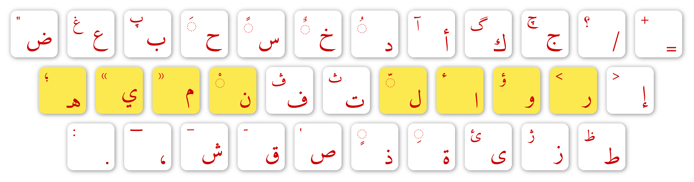

<h1 dir="ltr">Arak</h1>

Arak is a (family of) keyboard layout(s) for Arabic, influenced by Dvorak and other new projects like Workman.

Its main purpose is to be the Arabic Dvorak; for example, the only Arabic layout known and used everywhere is suitable to be used with Qwerty, but is uncomfortable for a Dvorak user. This has to be changed!

As Arak is made for Arabic speakers, the rest of the README is given in Arabic only.

<h1 dir="rtl">أراك</h1>

أراك مُعد ليكون «النسخة العربية من دڤوراك». وهو مبني على <a href="https://gist.github.com/noureddin/d9c3fd68fb07c19f1bb3b34b9fc14dce">إحصاءات حقيقية</a>.

لا شيء كامل؛ لذا فأراك ليس تخطيطا واحدا بل عائلة. لكنها حاليا عائلة من فرد واحد. هذا لتسهيل تحديث التخطيط متى احتجنا لذلك، وأيضا لضمان استقرار التخطيط المستخدم ومنع إحداث مشاكل بتغيير التخطيط الذي يستخدمه الناس.

<h2 dir="rtl">أراك 1</h2>

بعد معرفة <a href="https://gist.github.com/noureddin/d9c3fd68fb07c19f1bb3b34b9fc14dce">تردد الحروف</a>، وُزعت الحروف على لوحة المفاتيح تبعا للخريطة التالية، حيث الزر ذا الرقم الأقل هو الأسهل:

<pre dir="rtl"><code>9  9  5  2  2  3  4  4  3  2  2  5
  3  1  1  1  1  2  2  1  1  1  1
    5  5  5  4  3  5  3  5  5  5</code></pre>

فكان هذا الناتج: 

ملاحظات:

<ul dir="rtl">
<li dir="rtl">العالي + «ق» = شرطة <code>-</code></li>
<li dir="rtl">العالي + «ش» = شرطة سفلية <code>_</code></li>
<li dir="rtl">العالي + الفاصلة = تطويل/كشيدة <code>ـ</code></li>
<li dir="rtl">رمزي الضرب <code>×</code> والقسمة <code>÷</code> موجودان على الزر الذي بين العالي و«ئ» على التخطيط التقليدي، أي الزر الذي على يسار زر النقطة في أراك 1.</li>
<li dir="rtl">العالي = shift.</li>
</ul>
<h3 dir="rtl">خصائص أراك 1 عن التخطيط التقليدي</h3>
<ul dir="rtl">
<li dir="rtl">أنسب لمستخدمي دڤوراك
<ul dir="rtl">
<li dir="rtl">مواضع الكثير من الرموز مطابقة تمامًا لدڤوراك في المستويين (بزر العالي وبغيره)، وبعضها مطابق له في العالي فقط.</li>
<li dir="rtl">بعض العادات الدڤوراكية نُقلت لأراك 1، مثل كتابة الثنائيات «ال»، «وا»، وغيرها.</li>
</ul></li>
<li dir="rtl">تحسين مواضع الحروف
<ul dir="rtl">
<li dir="rtl">أحرف صف الارتكاز الثمانية وحدها، وبغير زر العالي، تمثّل أكثر من 60% من النص العربي المكتوب.</li>
<li dir="rtl">الحروف المكتوبة بزر العالي تمثل أقل من 5% من النص العربي المكتوب.</li>
<li dir="rtl">الأحرف الشائعة جدا مثل «أ»، والنقطة والفاصلة، تكتب بغير زر «العالي».</li>
<li dir="rtl">«و» مستخدم بكثرة. كذلك «ذ» المنبوذ أكثر استخدمًا من «ش» الذي يحتل مكانًا مَلَكيًّا في صف الارتكاز. في أراك الحروف مرتبة حسب كثرة استخدمها في اللغة العربية الفصحى.</li>
<li dir="rtl">الحروف نادرة الاستخدام مثل «ظ» تكتب بزر العالي، لتسهيل الوصول للحروف الأكثر استخدامًا.</li>
<li dir="rtl">علامات التشكيل في مواضع متناظرة، وفي منتصف اللوحة، مما يسهّل تعلمها واستخدامها.</li>
</ul></li>
<li dir="rtl">تعديل مجموعة حروف التخطيط نفسها
<ul dir="rtl">
<li dir="rtl">أزرار «لا» و«لأ» و«لآ» إنما وُجدت للآلة الكاتبة، ولا يوجد منطق وراء إضافتها لأزرار الحاسوب؛ أكثرهم انتشارًا أقل من «ال» و«وا».</li>
<li dir="rtl">إضافة بعض الحروف الفارسية المستخدمة أحيانا في العربية لتمثيل أصوات أجنبية: «پ»، «چ»، «ژ»، «ڤ»، «گ»، والتي يوصل إليها بضغط العالي مع زر الحرف العربي المناظر لها شكلًا.</li>
<li dir="rtl">إضافة علامتي التنصيص المفضلتين لدى كثيرٍ من الكتاب العرب <code>«»</code>؛ فهي أنسب للنص العربي من التنصيص المرتفع <code>&quot;&quot;</code> الذي قد يشبه تنوينًا أو نقطين. مع الإبقاء على رمزي الأسكي <code>'</code>، <code>&quot;</code>.</li>
<li dir="rtl">لا وجود للفاصلة الغربية <code>,</code> بين الحروف العربية.</li>
</ul></li>
<li dir="rtl">لا حاجة للمستوى الثالث
<ul>
<li dir="rtl">في التخطيط التقليدي، المستوى الثالث كان مستخدمًا للوصول لـ<code>«»</code> و«چ» و«پ» و«ڤ»؛ هذه الحروف والرموز في المستوى الثاني مباشرةً الآن.</li>
</ul></li>
</ul>
<h3 dir="rtl">تعلم أراك 1</h3>
<blockquote dir="rtl">

سأكمل هذا القسم لاحقا.

</blockquote>

إن كنت لا تمانع إمضاء شهرًا أو أكثر بسرعة بطيئة، يمكنك الانتقال الآن، مسترشدًا بصورة التخطيط؛ يمكنك نقلها على ورقة أو طباعتها. وعليك بالتمرين يوميا ولو لعشر دقائق. يمكنك الاستعانة بهذا <a href="https://10fastfingers.com/typing-test/arabic">الموقع</a>.

<h3 dir="rtl">تثبيت أراك 1</h3>
<blockquote dir="rtl">

هذا القسم يحتاج للتحسين!

</blockquote>

لتثبيت أراك 1، يمكنك تنفيذ هذا الأمر في الطرفية:

<pre dir="ltr"><code>sudo wget https://raw.githubusercontent.com/noureddin/arak/master/ark1 -O /usr/share/X11/xkb/symbols/ark1</code></pre>

ولاستخدامه مع دڤوراك، نفذ هذا الأمر بصلاحيات المستخدم العادي:

<pre dir="ltr"><code>setxkbmap dvorak,ark1</code></pre>

للأسف قد لا يمكنك اختيار أراك من الواجهة الرسومية؛ عليك تفعيله من سطر الأوامر. لجعل دڤوراك وأراك يعملان من بدء التشغيل، نفّذ هذه الأوامر في الطرفية:

<pre dir="ltr"><code>mkdir -p ~/.config/autostart
wget https://raw.githubusercontent.com/noureddin/arak/master/keyboardlayout.desktop -O ~/.config/autostart/keyboardlayout.desktop
chmod +x ~/.config/autostart/keyboardlayout.desktop
xdg-open ~/.config/autostart/keyboardlayout.desktop</code></pre>
<h2 dir="rtl">ترخيص الاستخدام</h2>

افعل ما تشاء، لكن أرجو ألا تستخدم لفظ «أراك» في اسم أي تخطيط لوحة مفاتيح بغير إذني منعًا للبس. شكرًا!

